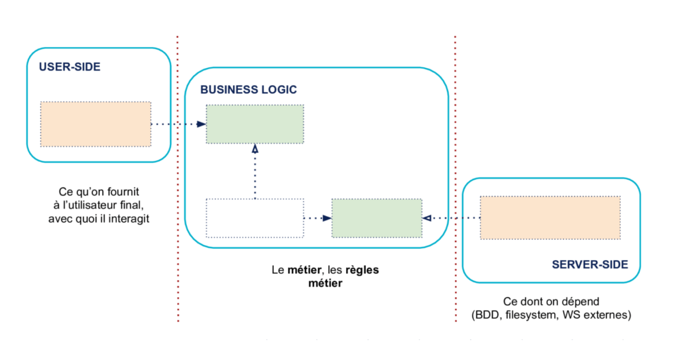
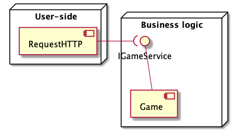

# Architecture hexagonale

## Principe du patron

* Ce patron a pour but de séparer un projet en trois parties distinctes :
  * **User-side**
  * **Business Logic**
  * **Server-side**

Comme ci-dessous :

On peut voir que cette architecture va bien isoler les parties de notre projet, ce qui va permettre de faire des tests complètement indépendants dans chaque partie.

# Dans notre projet

⚠️ Dans notre projet, la partie **Server-side** n'existe pas, car nous ne traitons pas de persistance de données.
Les deux parties existantes sont donc **User-side** et **Business logic**.

## À quoi correspondent les parties ?

### Partie User-side

* Dans notre projet la partie **User-side** correspond aux fichiers `HttpRequest` dans le module `ServerModule` où sont implémentées les routes HTTP de notre serveur.
  Cette partie va aussi utiliser par **injection** une interface `IGameService` mise à disposition par la partie **Business Logic**.

### Partie Business Logic

* Dans la partie **Business Logic** (module `GameModule`), nous allons avoir toute la logique correspondant au jeu (`Game`).

### Schéma représentatif

.png)